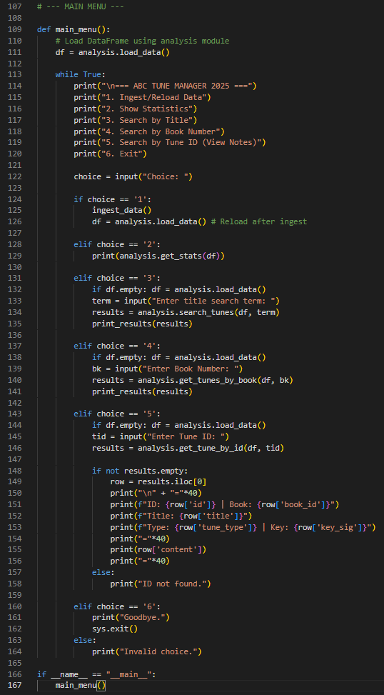
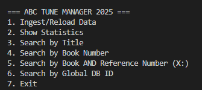
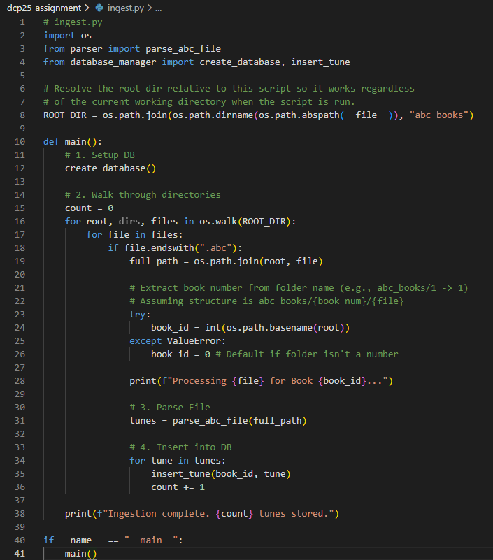
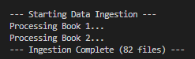
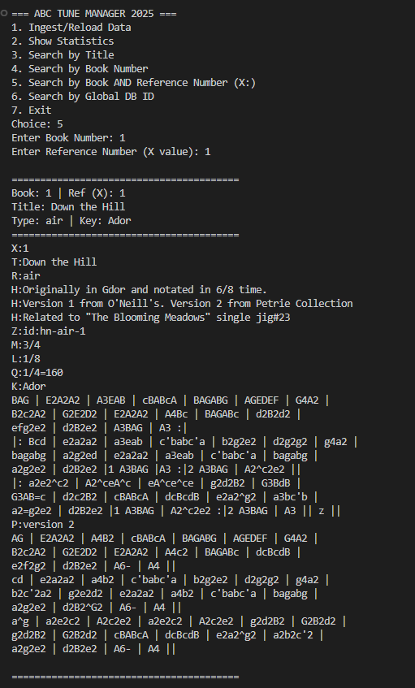
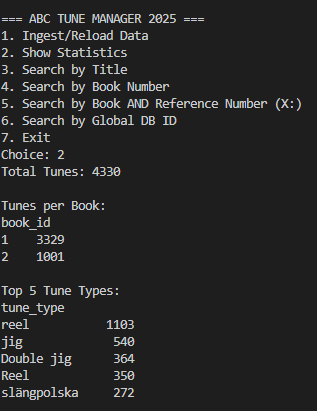

# Data Centric Programming Assignment 2025

- [Assignment Brief](assignment.md)

Name: Seanne Oriemo

Student Number: C24384533

Course Code: TU850 - 2

# Screenshots

**Main Menu Interface:**
 
 

**Data Ingestion Process:**



**Searching for Tunes:**


**Viewing Statistic details:**



# Description of the project

This project is a Python-based application designed to manage and analyze a collection of traditional music tunes stored in ABC notation format. The system acts as a bridge between raw file storage, a structured SQL database, and a user-friendly analysis interface.

The application recursively traverses a directory structure of "books" (folders), parses `.abc` text files to extract metadata (Title, Key, Meter, Type) and content, and stores them in a SQLite database. Users can then interact with this data via a Command Line Interface (CLI) to perform searches, filter by specific books, view statistics, and retrieve the raw musical notation for specific tunes.

# Instructions for use

1. **Prerequisites:**
   - Ensure Python 3.x is installed.
   - Install the required library: `pip install pandas`.

2. **Setup:**
   - Place the `abc_books` folder in the same directory as the scripts.
   - Ensure the folder structure is maintained (e.g., `abc_books/1/tune.abc`).

3. **Running the Application:**
   - Open a terminal/command prompt.
   - Navigate to the project folder.
   - Run the command: `python main.py`

4. **Using the Menu:**
   - **Option 1:** Run this first to build/reset the database (`tunes.db`).
   - **Option 2:** View summary statistics of the collection.
   - **Option 3:** Search for tunes by title (case-insensitive).
   - **Option 4:** List all tunes within a specific book number.
   - **Option 5:** View the full ABC notation for a specific tune ID.
   - **Option 6:** Exit the application.

# How it works:

The project is structured into modular components:

1.  **File Parsing (`ingest_data` in `main.py`):**
    - The script uses `os.walk` to find all `.abc` files.
    - It reads files line-by-line, detecting headers (X:, T:, K:) to separate individual tunes and extract metadata.

2.  **Database Management (`sqlite3`):**
    - A SQLite database (`tunes.db`) is created automatically.
    - Data is normalized into a `tunes` table with columns for ID, Book ID, Title, Type, Meter, Key, and Content.

3.  **Data Analysis (`analysis.py`):**
    - Pandas is used to load the SQL data into a DataFrame.
    - Helper functions allow for efficient filtering (Boolean indexing) and string manipulation for searches.

4.  **User Interface (`main.py`):**
    - A `while` loop maintains the menu state.
    - User input is validated before being passed to the analysis functions.

5.  **Manual Testing (`test.py`):**
    - importing the analysis module and running the functions against the real database to verify they return the correct rows. 

# List of files in the project

| Files | Source |
|-----------|-----------|
| main.py | Self written |
| test.py | Modified from [reference]() |
| test.py | From [reference]() |

# References
* Item 1
* Item 2

# What I am most proud of in the assignment

Bla bla bla

# What I learned

Bla bla bla

## Below is how to use Markdown. You can delete this:

## This is how to markdown text:

This is *emphasis*

This is a bulleted list

- Item
- Item

This is a numbered list

1. Item
1. Item

This is a [hyperlink](http://bryanduggan.org)

# Headings
## Headings
#### Headings
##### Headings

This is code:

```Java
public void render()
{
	ui.noFill();
	ui.stroke(255);
	ui.rect(x, y, width, height);
	ui.textAlign(PApplet.CENTER, PApplet.CENTER);
	ui.text(text, x + width * 0.5f, y + height * 0.5f);
}
```

So is this without specifying the language:

```
public void render()
{
	ui.noFill();
	ui.stroke(255);
	ui.rect(x, y, width, height);
	ui.textAlign(PApplet.CENTER, PApplet.CENTER);
	ui.text(text, x + width * 0.5f, y + height * 0.5f);
}
```


This is a table:

| Heading 1 | Heading 2 |
|-----------|-----------|
|Some stuff | Some more stuff in this column |
|Some stuff | Some more stuff in this column |
|Some stuff | Some more stuff in this column |

|Some stuff | Some more stuff in this column |
